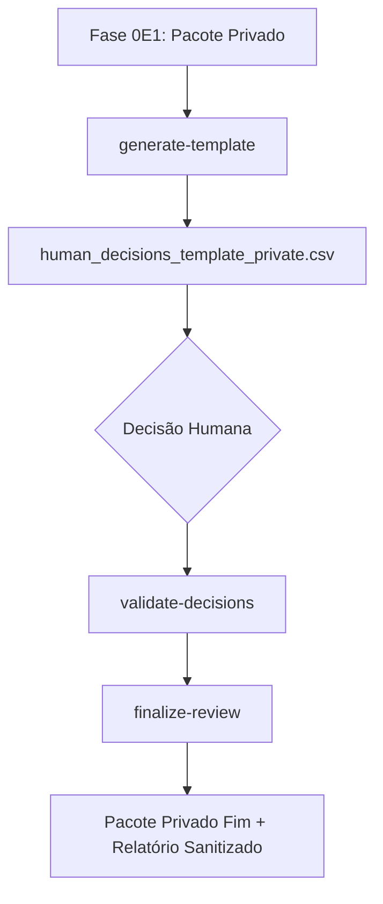

# Revisão Humana Offline — Fase 0E2

Este documento estabelece o modelo arquitetural e as diretrizes do processo de revisão humana offline da Fase 0E2.

## 1. Escopo e Propósito
A Fase 0E2 implementa um processo de revisão humana estritamente offline sobre as propostas privadas da Fase 0E1. O objetivo principal é analisar as propostas de mapping de classe F sob um regime controlado e sem alterar o banco de dados.

* **CONFIRMADO NO CÓDIGO**: Toda a lógica de revisão é executada offline. Não há conexões com banco de dados de produção ou staging.
* **VALIDADO OFFLINE**: As ferramentas operam unicamente com leitura e escrita de arquivos locais de configuração privada.
* **FORA DE ESCOPO**: Não há cadastros automatizados, deploys, bootstraps, migração de dados ou escrita em banco de dados nesta etapa.

## 2. Fluxo Geral

Nenhuma proposta pode ser aprovada diretamente ou alterada de classe sem um processo formal e auditado em fases futuras.
